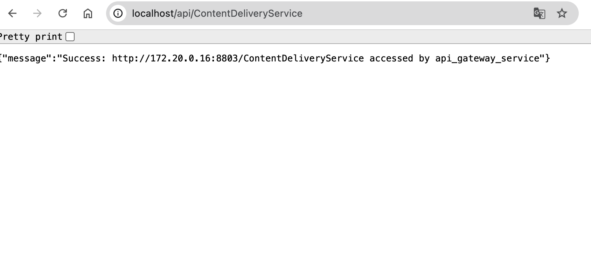

# # Microservice docker showcase


## Introduction

This project shows how to implement a microservice-like architecture using docker compose.Through the output of the console, you can clearly see the entire calling process from the outside to the inside


## Architecture

**Implemented the core part of the below architecture**


## Feature

1. The project has Loadbalance mounted on the front end, and can be observed through the actual access API Gateway instance name.
2. The API gateway also integrates the function of authentication, and authenticates through a special header header to simulate verification of cookies.
3. The backend provides three aggregation services to the outside world. The aggregation service will automatically call other internal services on the backend through the built-in DNS of the Docker network.
4. Personal environment: docker-desktop:4.43.1 (198352), npm:11.5.2, node:22.9.0


## Usage

### 1. Commom command

Install dependencies and run

```
git clone <repo>
cd <repo>
npm install
docker compose up --build
```

Scale specific services to 10 containers

```
docker-compose up --build --scale content_creating_service=10 --scale content_delivery_service=10
```


Stop all the containers and remove all the images

```
docker compose down -v --rmi all --remove-orphans
```

### 2.Effect Demonstration

Project start


Gateway request


Service request




